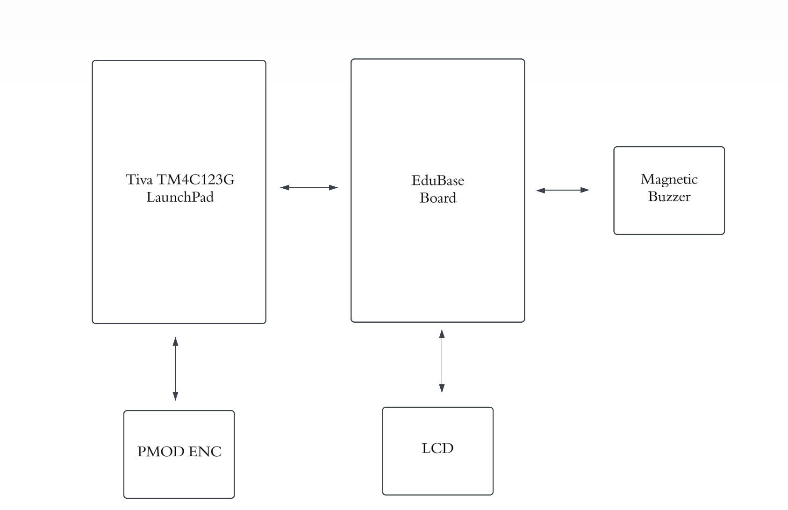

<h1> BEATBOX-ECE-425-Final-Project</h1>
  
<h2>Introduction</h2>

This repository contains the Keil uVision5 project files for my BEATBOX project, developed for the ECE 425 (Microprocessor Systems)class in Fall 2024. The project features a musical device powered by the TM4C123GXL LaunchPad, integrating a rotary encoder, 16x2 LCD, and a piezo buzzer to deliver customizable sound experiences.
  

Performed By:

<ul>
  <li>Antonio Anzora Jr</li>
</ul>

Professor:

<ul>
  <li>Aaron Nanas</li>
</ul>

<h2>Description</h2>

<ul>
<li>The project utilizes the TM4C123GXL LaunchPad Microcontroller to create an interactive music player system capable of playing 4 different songs. The setup includes a piezo buzzer for audio input, a 16x2 LCD Display for menu navigation and song selection, a rotary encoder for user input, and jumper wires for connectivity. This combination allows users to select and play songs with visual feedback through display.</li>
</ul><ul>
  
</ul><ul>
<li>This project aims to design and build a simple, cost-effective, and interactive music-playing device that can be used for educational purposes or as a prototype for more advanced projects. By incorporating a user-friendly interference through the rotary encoder and LCD, the system allows users to select and play 4 songs, with clear visual feedback on the display. This improves accessibility and usability compared to traditional music systems.</li>
</ul>

<h2>Block Diagram</h2>

<ul>
  

</ul>
<h2>Components Used</h2>

|         Description                   | Quantity          |    Manufacturer   |    Price ($)       |    Link       |
|         :-------------:                 |:-------------:    | :-----:            |    :-----:          |    :-----:          |
| Tiva C Series TM4C123G LaunchPad      | 1                 | Texas Instruments |   22.99 per unit   |    [Product Link](https://www.mouser.com/ProductDetail/Texas-Instruments/EK-TM4C123GXL?qs=TB%2FQ0sBK%2FGefKGr%252BQsiJWQ%3D%3D)       |
| USB-A to Micro-USB Cable              | 1                 |       N/A         |   6.99 per unit    |    [Product Link](https://www.digikey.com/en/products/detail/sparkfun-electronics/CAB-24508/22321088?gclsrc=aw.ds&&utm_adgroup=&utm_source=google&utm_medium=cpc&utm_campaign=PMax%20Shopping_Product_Low%20ROAS%20Categories&utm_term=&utm_content=&utm_id=go_cmp-20243063506_adg-_ad-__dev-c_ext-_prd-22321088_sig-CjwKCAiAmfq6BhAsEiwAX1jsZ-H07hC3CwGiLi2op_HnKewSouCI1NDJatIYMBnhYX5nmB_97Dw_4xoCQnAQAvD_BwE&gad_source=1&gclid=CjwKCAiAmfq6BhAsEiwAX1jsZ-H07hC3CwGiLi2op_HnKewSouCI1NDJatIYMBnhYX5nmB_97Dw_4xoCQnAQAvD_BwE&gclsrc=aw.ds)      |
|         EduBase Board                 | 1                 |   Trainer4Edu     |   169.99 per unit  |    [Product Link](https://www.trainer4edu.com/edubase_v2/ti_arm_tiva_msp432_launchpad.html)       |
|     Small Flathead Screwdriver        | 1                 |       N/A         |   1.19 per unit    |    [Product Link](https://www.sykessler.com/product/small-flat-head-screwdriver/)       |
|     PMOD ENC (Rotary Encoder)         | 1                 |       N/A         |   6.99 per unit    |    [Product Link](https://digilent.com/shop/pmod-enc-rotary-encoder/?srsltid=AfmBOoogCrdWyBcuDFI5qA5gxddaanvtuNNJUkPz-lh6bLyRYOKz-AXH)       |

<h2>Songs Available</h2>

| Song Name                  | Duration       | Genre          | Menu Option | Special Notes                            |
|----------------------------|----------------|----------------|-------------|------------------------------------------|
| Super Mario Bros Theme     | Approx. 1 min  | Video Game     | Option 1    | Nostalgic and iconic                     |
| Doom Theme Song            | Approx. 1 min  | Game/Metal     | Option 2    | Intense and thrilling                    |
| Like Him - Tyler the Creator | Approx. 1 min| Hip-Hop        | Option 3    | Reflective and deep                      |
| **TBD:** MF Doom (MM..Food)| Approx. 1 min  | Hip-Hop        | Option 4    | A tribute to MF Doom's creative genius   |

</ul>

<h1>Drawing Mario on a 16x2 LCD: A Step-by-Step Tutorial</h1>
General Procedure:

1. We begin by designing a 5x8 pixel representation of Mario that fits into the custom character slots of the 16x2 LCD.
2. Use a pixel art tool or online link (like a pixel editor) to create the design. You can use this link to get an idea of how the Mario pixel design should look on the 16x2 LCD. [Click Here](https://chareditor.com/)
3. The design will take up 6 parts of 5x8 pixel art for Mario's torso, legs, head, etc.
4. Next, using another online tool or design editor, create separate shapes for Mario's torso, leg, head, etc., ensuring that you use blue as the background color and select the Hex data type for each shape.[Click Here]( https://maxpromer.github.io/LCD-Character-Creator/)
5. For each shape, obtain the Hexadecimal values for each 5x8 character representation.
6. These Hexadecimal values should be 8 characters long (e.g., `0xFF, 0x81, 0x81, ...`), and you can copy and paste them directly.
7. After obtaining the Hexadecimal values for Mario’s design, place these values into the header file that controls the LCD.
8. This involves declaring these values as custom characters for the 16x2 LCD to reference them in your main code for display.
9. Finally, you can call the custom character functions in your main program to display the Mario logo on the 16x2 LCD screen. Ensure that you position the custom characters properly across the two lines of the LCD.
10. With these steps, Mario should be displayed across the 16x2 LCD as a series of custom characters, giving you a pixelated Mario design! The key is ensuring that each part of the design is carefully mapped and represented using the 5x8 matrix custom characters.
11. It’s important to note that the 16x2 LCD has a limitation when it comes to displaying custom characters. The LCD's Character Generator RAM (CGRAM) can only store up to 8 custom characters at a time. Each custom character takes up 1 byte of memory, and since there are only 8 available slots, this limits the number of designs you can display at any given time. If you need to display more custom characters, you'll have to overwrite existing ones, which may require careful management of character memory to ensure the desired display.

<h2>Acknowledgement</h2>

<ul>
<li>Ever since I was young, I have always enjoyed playing Super Mario Bros, which sparked my interest in learning how to display characters on an LCD. My initial plan was to familiarize myself with basic LCD display techniques and eventually move on to a more ambitious project—a Super Mario Bros game using a different type of LCD display. This is why I decided to include a mini animation for Mario with his theme song playing in the background. Another key motivation for choosing this project was the recent release of a new album by one of my favorite artists. This inspired me to explore the possibility of playing music through a piezo buzzer, combining my love for music with my interest in electronics and programming.</li>
</ul><ul>
<li>This project was built upon various tutorials and guides that provided essential knowledge on programming the TM4C123GXL LaunchPad and interfacing with components such as the LCD, rotary encoder, and piezo buzzer. These resources helped me understand the necessary coding techniques and hardware connections required to develop the system.</li>
</ul><ul>
<li>I greatly appreciate the clear explanations and step-by-step instructions that made it possible to integrate these components seamlessly. Special thanks to Professor Aaron Nanas and the ECE 425 Microprocessor Systems course for their comprehensive insights and support throughout the development process.</li>
</ul><h2>Contact</h2>

>>>>>>> 3e3f6490fe8f4a0c7f1904673ced3e27cef021a8
